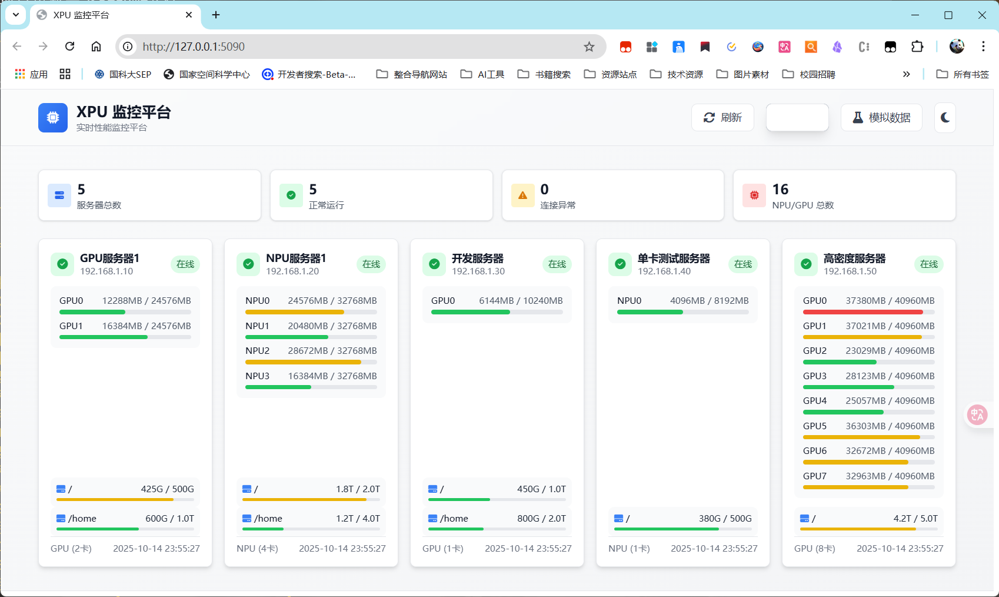

# XPU Monitor

一个功能强大的Web端XPU（NPU/GPU）监控平台，支持实时监控多台本地和远程服务器上的计算设备状态。



## ✨ 功能特性

### 🔍 核心监控功能
- **实时监控**: 实时显示NPU/GPU温度、功耗、显存使用率、计算利用率
- **多设备支持**:
  - NPU监控 (华为昇腾) - 通过 `npu-smi info` 命令
  - GPU监控 (NVIDIA) - 通过 `nvidia-smi` 命令
- **本地与远程**: 支持本地监控和远程SSH监控

### 🌐 高级功能
- **多服务器支持**: 同时监控多台服务器
- **存储监控**: 实时监控磁盘空间使用情况
- **Docker监控**: 监控Docker镜像和容器状态
- **智能建议**: 基于LLM的存储优化建议（可选）

### 🔧 连接方式
- **SSH密码认证**: 支持传统密码登录
- **SSH密钥认证**: 支持RSA、Ed25519、ECDSA密钥
- **跳板机支持**: 通过跳板机连接内网服务器
- **本地监控**: 支持Windows和Linux本地监控

### 📱 用户体验
- **响应式设计**: 完美适配桌面和移动设备
- **实时更新**: Server-Sent Events (SSE) 实现流畅的实时数据流
- **直观界面**: 颜色编码显示设备状态和警告
- **配置管理**: Web界面直接管理服务器配置

## 🚀 快速开始

### 1. 环境准备

**Python要求**: Python 3.7+

**安装依赖**:
```bash
pip install -r requirements.txt
```

### 2. 配置服务器

编辑 `config/servers.json` 文件配置要监控的服务器：

#### 基础配置示例
```json
{
  "servers": [
    {
      "name": "本地GPU",
      "host": "127.0.0.1",
      "type": "gpu",
      "local": true,
      "enable_storage_monitoring": true,
      "enable_docker_monitoring": true
    },
    {
      "name": "远程NPU服务器",
      "host": "192.168.1.100",
      "port": 22,
      "type": "npu",
      "auth": {
        "type": "password",
        "username": "root",
        "password": "your_password"
      },
      "enable_storage_monitoring": true,
      "enable_docker_monitoring": true
    }
  ]
}
```

#### 高级配置示例
```json
{
  "servers": [
    {
      "name": "密钥认证服务器",
      "host": "192.168.1.101",
      "port": 22,
      "type": "gpu",
      "auth": {
        "type": "key",
        "username": "ubuntu",
        "key_file": "/path/to/private_key",
        "key_password": null
      }
    },
    {
      "name": "跳板机服务器",
      "host": "10.0.0.50",
      "port": 22,
      "type": "npu",
      "auth": {
        "type": "password",
        "username": "root",
        "password": "bastion_password"
      },
      "bastion": {
        "host": "jump.example.com",
        "port": 22,
        "auth": {
          "type": "key",
          "username": "jump_user",
          "key_file": "/path/to/jump_key",
          "key_password": "jump_key_password"
        }
      }
    }
  ],
  "llm_config": {
    "enabled": false,
    "api_url": "https://api.openai.com/v1/chat/completions",
    "api_key": "your_api_key",
    "model": "gpt-3.5-turbo"
  }
}
```

### 3. 启动应用

#### 开发模式
```bash
python app.py
```

#### 生产模式
```bash
python run.py
```

#### Windows批处理
```batch
start.bat
```

### 4. 访问界面

打开浏览器访问: http://localhost:5000 (开发模式) 或 http://localhost:5090 (生产模式)

## 📋 配置参数详解

### 服务器配置参数

| 参数 | 类型 | 必需 | 说明 |
|------|------|------|------|
| `name` | string | ✅ | 服务器显示名称 |
| `host` | string | ✅ | 服务器IP地址或域名 |
| `type` | string | ✅ | 设备类型: `"npu"` 或 `"gpu"` |
| `local` | boolean | ❌ | 是否为本地服务器 (默认: false) |
| `port` | integer | ❌ | SSH端口 (默认: 22) |
| `enable_storage_monitoring` | boolean | ❌ | 启用存储监控 (默认: true) |
| `enable_docker_monitoring` | boolean | ❌ | 启用Docker监控 (默认: true) |

### 认证配置 (auth)

#### 密码认证
```json
{
  "type": "password",
  "username": "your_username",
  "password": "your_password"
}
```

#### 密钥认证
```json
{
  "type": "key",
  "username": "your_username",
  "key_file": "/path/to/private_key",
  "key_password": "optional_key_password"
}
```

### 跳板机配置 (bastion)

```json
{
  "host": "jump.server.com",
  "port": 22,
  "auth": {
    "type": "key",
    "username": "jump_user",
    "key_file": "/path/to/jump_key"
  }
}
```

### LLM配置 (可选)

```json
{
  "llm_config": {
    "enabled": true,
    "api_url": "https://api.openai.com/v1/chat/completions",
    "api_key": "your_api_key",
    "model": "gpt-3.5-turbo"
  }
}
```

## 🔌 API接口

### RESTful API

#### 服务器管理
- `GET /api/servers` - 获取所有服务器状态
- `GET /api/servers/<host>` - 获取指定服务器状态
- `POST /api/refresh` - 手动刷新所有服务器状态

#### 配置管理
- `GET /api/config` - 获取服务器配置
- `POST /api/config` - 更新服务器配置
- `POST /api/config/server` - 添加新服务器
- `DELETE /api/config/server/<name>` - 删除服务器

#### 存储分析
- `GET /api/storage/suggestions/<host>` - 获取存储优化建议
- `POST /api/storage/analyze` - 分析多个服务器存储状况

#### LLM配置
- `GET /api/config/llm` - 获取LLM配置
- `POST /api/config/llm` - 更新LLM配置

### Server-Sent Events (SSE)

#### 实时数据流
- `GET /api/sse` - 实时服务器状态数据流

**事件类型**:
- `initial_data` - 初始数据
- `servers_refreshed` - 服务器状态更新
- `heartbeat` - 心跳保活

#### Mock数据
- `GET /api/mock/data` - 获取模拟数据用于前端测试

## 🏗️ 项目结构

```
xpu-monitor/
├── app.py                    # 主应用程序 (Flask + SSE)
├── run.py                    # 生产环境启动脚本
├── requirements.txt          # Python依赖包
├── config/
│   └── servers.json         # 服务器配置文件
├── templates/
│   └── index.html           # Web界面 (单页应用)
├── static/
│   ├── css/
│   │   └── style.css        # 样式文件
│   └── js/
│       └── app.js           # 前端JavaScript
├── docs/
│   └── pic1.png            # 效果图
├── CLAUDE.md               # Claude开发指南
├── IFLOW.md                # 信息流程图
├── LICENSE                 # MIT许可证
└── README.md               # 项目文档
```

## 💻 系统要求

### 监控端 (运行此应用)
- **操作系统**: Windows 10+, Linux, macOS
- **Python**: 3.7+
- **内存**: 最少512MB
- **网络**: 能够连接到被监控服务器

### 被监控服务器

#### NPU服务器
- **操作系统**: Linux (Ubuntu/CentOS等)
- **驱动**: 华为昇腾NPU驱动
- **工具**: `npu-smi` 命令可用
- **SSH**: SSH服务正常运行

#### GPU服务器
- **操作系统**: Linux (Ubuntu/CentOS等)
- **驱动**: NVIDIA GPU驱动
- **工具**: `nvidia-smi` 命令可用
- **SSH**: SSH服务正常运行

#### 本地监控 (Windows)
- **系统**: Windows 10/11
- **工具**: NVIDIA GPU驱动 + nvidia-smi

## 🔧 故障排除

### 常见问题

#### 1. SSH连接失败
```bash
# 检查SSH连接
ssh username@server_ip -p port

# 常见原因:
# - IP地址或端口错误
# - 用户名或密码错误
# - SSH服务未启动
# - 防火墙阻止连接
# - 网络不通
```

#### 2. 命令执行失败
```bash
# 在目标服务器上检查命令
nvidia-smi  # 或 npu-smi info

# 常见原因:
# - 驱动未正确安装
# - 用户权限不足
# - 命令不在PATH中
```

#### 3. SSE连接问题
- 检查浏览器控制台错误信息
- 确认防火墙设置
- 验证网络连接稳定性

#### 4. 本地监控问题 (Windows)
- 确认NVIDIA驱动正确安装
- 检查nvidia-smi命令是否可用
- 验证PATH环境变量

### 调试模式

启用调试模式获取详细日志:

```python
# 修改 app.py 最后一行
if __name__ == '__main__':
    # 初始化数据
    update_all_servers()

    # 启动后台更新线程
    update_thread = threading.Thread(target=background_update, daemon=True)
    update_thread.start()

    # 启动服务器 (调试模式)
    app.run(host='0.0.0.0', port=5000, debug=True)
```

### 日志分析

应用日志显示:
- SSH连接状态
- 命令执行结果
- 数据解析过程
- SSE客户端连接
- 错误详细信息

## 🔐 安全建议

### 1. 认证安全
- 使用SSH密钥认证替代密码
- 为监控创建专用用户账户
- 限制监控用户权限 (只能执行npu-smi/nvidia-smi等命令)

### 2. 网络安全
- 使用VPN或专用网络
- 配置防火墙规则限制访问
- 定期更新SSH密钥

### 3. 应用安全
- 定期更新依赖包
- 使用HTTPS (生产环境推荐)
- 定期备份配置文件

## 🚀 性能优化

### 1. 监控频率
- 默认30秒刷新一次，可在代码中调整
- 服务器数量多时可适当增加间隔

### 2. 并发控制
- 默认最大6个并发连接
- 可根据服务器性能调整

### 3. 内存使用
- 使用SSE替代WebSocket减少内存占用
- 客户端队列限制最大100条消息

## 🤝 贡献指南

欢迎提交Issue和Pull Request！

### 开发环境设置
1. Fork项目
2. 创建功能分支
3. 提交更改
4. 创建Pull Request

### 代码规范
- 遵循PEP 8 Python代码规范
- 添加适当的注释和文档
- 确保所有测试通过

## 📄 许可证

本项目采用 MIT 许可证 - 查看 [LICENSE](LICENSE) 文件了解详情

## 🙏 致谢

- [Flask](https://flask.palletsprojects.com/) - Web框架
- [Paramiko](https://www.paramiko.org/) - SSH库
- [Bootstrap](https://getbootstrap.com/) - UI框架
- 所有贡献者和用户的支持

---

**如有问题或建议，欢迎提交Issue或联系维护者！**