# XPU Monitor 设计文档

## 目录

1. [需求分析](#1-需求分析)
2. [系统架构](#2-系统架构)
3. [数据格式设计](#3-数据格式设计)
4. [前后端演化逻辑](#4-前后端演化逻辑)
5. [核心机制实现](#5-核心机制实现)
6. [性能优化策略](#6-性能优化策略)
7. [扩展性设计](#7-扩展性设计)

---

## 1. 需求分析

### 1.1 需求演化历程

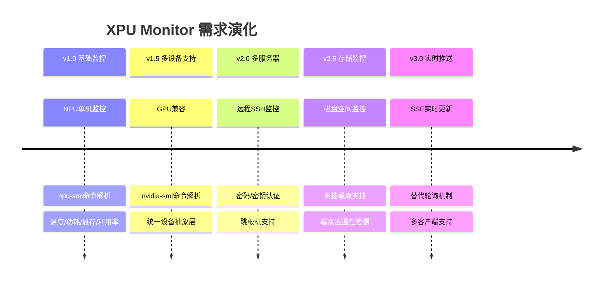
```mermaid
timeline
    title XPU Monitor 需求演化
    section v1.0 基础监控
        NPU单机监控 : npu-smi命令解析
        : 温度/功耗/显存/利用率
    section v1.5 多设备支持
        GPU兼容 : nvidia-smi命令解析
        : 统一设备抽象层
    section v2.0 多服务器
        远程SSH监控 : 密码/密钥认证
        : 跳板机支持
    section v2.5 存储监控
        磁盘空间监控 : 多挂载点支持
        : 端点连通性检测
    section v3.0 实时推送
        SSE实时更新 : 替代轮询机制
        : 多客户端支持
```

### 1.2 功能需求矩阵

| 需求模块 | 功能点 | 优先级 | 状态 |
|---------|--------|--------|------|
| **设备监控** | NPU状态采集 | P0 | ✅ |
| | GPU状态采集 | P0 | ✅ |
| | 温度/功耗/显存/利用率 | P0 | ✅ |
| **服务器管理** | 本地监控 | P0 | ✅ |
| | 远程SSH监控 | P0 | ✅ |
| | 跳板机连接 | P1 | ✅ |
| | 多服务器并行采集 | P0 | ✅ |
| **存储监控** | 磁盘空间监控 | P1 | ✅ |
| | 多挂载点支持 | P1 | ✅ |
| | 端点连通性检测 | P1 | ✅ |
| **实时推送** | SSE数据流 | P0 | ✅ |
| | 心跳保活 | P0 | ✅ |
| **用户体验** | 响应式布局 | P1 | ✅ |
| | 深色模式 | P2 | ✅ |
| | 详情模态框 | P1 | ✅ |

### 1.3 非功能需求

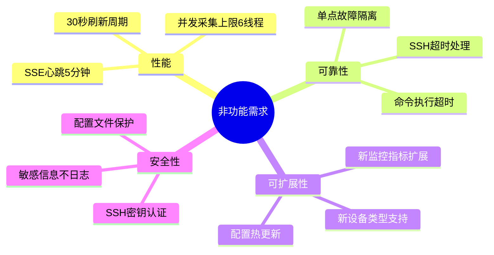
```mermaid
mindmap
  root((非功能需求))
    性能
      30秒刷新周期
      并发采集上限6线程
      SSE心跳5分钟
    可靠性
      单点故障隔离
      SSH超时处理
      命令执行超时
    可扩展性
      新设备类型支持
      新监控指标扩展
      配置热更新
    安全性
      SSH密钥认证
      配置文件保护
      敏感信息不日志
```

---

## 2. 系统架构

### 2.1 整体架构图

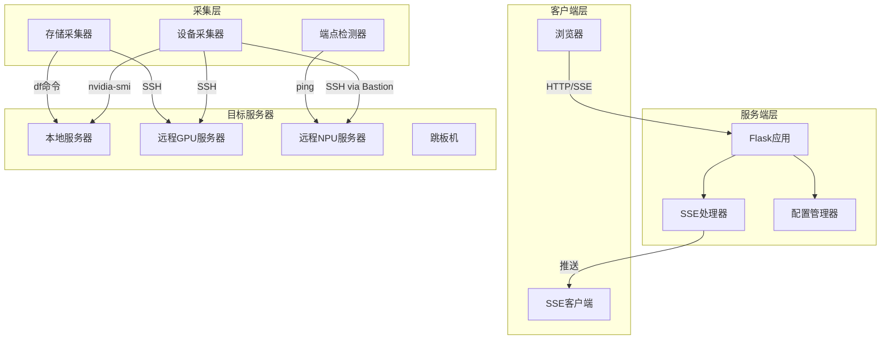
```mermaid
graph TB
    subgraph Client["客户端层"]
        Browser[浏览器]
        SSE[SSE客户端]
    end
    
    subgraph Server["服务端层"]
        Flask[Flask应用]
        SSE_Handler[SSE处理器]
        Config_Mgr[配置管理器]
    end
    
    subgraph Collector["采集层"]
        Device_Collector[设备采集器]
        Storage_Collector[存储采集器]
        Endpoint_Collector[端点检测器]
    end
    
    subgraph Target["目标服务器"]
        Local[本地服务器]
        Remote_GPU[远程GPU服务器]
        Remote_NPU[远程NPU服务器]
        Bastion[跳板机]
    end
    
    Browser -->|HTTP/SSE| Flask
    Flask --> SSE_Handler
    Flask --> Config_Mgr
    SSE_Handler -->|推送| SSE
    
    Device_Collector -->|nvidia-smi| Local
    Device_Collector -->|SSH| Remote_GPU
    Device_Collector -->|SSH via Bastion| Remote_NPU
    
    Storage_Collector -->|df命令| Local
    Storage_Collector -->|SSH| Remote_GPU
    
    Endpoint_Collector -->|ping| Remote_NPU
```

### 2.2 模块职责划分

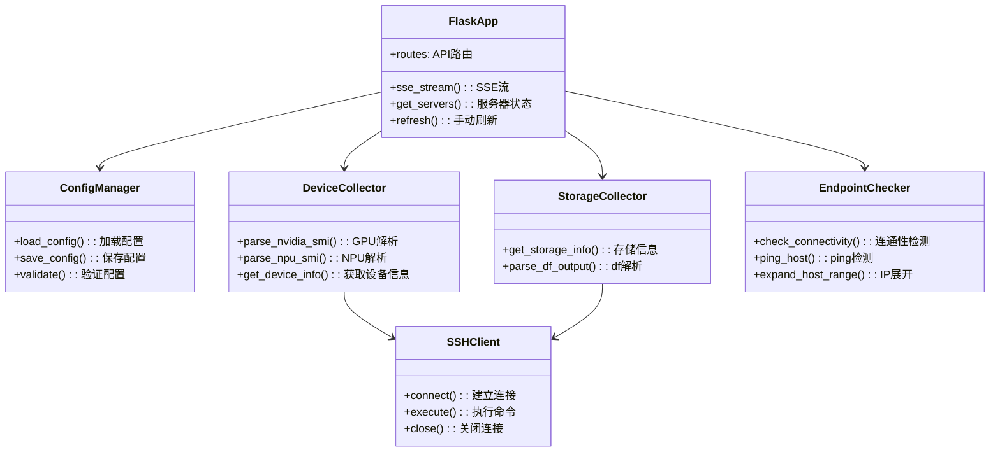
```mermaid
classDiagram
    class FlaskApp {
        +routes: API路由
        +sse_stream(): SSE流
        +get_servers(): 服务器状态
        +refresh(): 手动刷新
    }
    
    class ConfigManager {
        +load_config(): 加载配置
        +save_config(): 保存配置
        +validate(): 验证配置
    }
    
    class DeviceCollector {
        +parse_nvidia_smi(): GPU解析
        +parse_npu_smi(): NPU解析
        +get_device_info(): 获取设备信息
    }
    
    class StorageCollector {
        +get_storage_info(): 存储信息
        +parse_df_output(): df解析
    }
    
    class EndpointChecker {
        +check_connectivity(): 连通性检测
        +ping_host(): ping检测
        +expand_host_range(): IP展开
    }
    
    class SSHClient {
        +connect(): 建立连接
        +execute(): 执行命令
        +close(): 关闭连接
    }
    
    FlaskApp --> ConfigManager
    FlaskApp --> DeviceCollector
    FlaskApp --> StorageCollector
    FlaskApp --> EndpointChecker
    DeviceCollector --> SSHClient
    StorageCollector --> SSHClient
```

---

## 3. 数据格式设计

### 3.1 配置数据结构

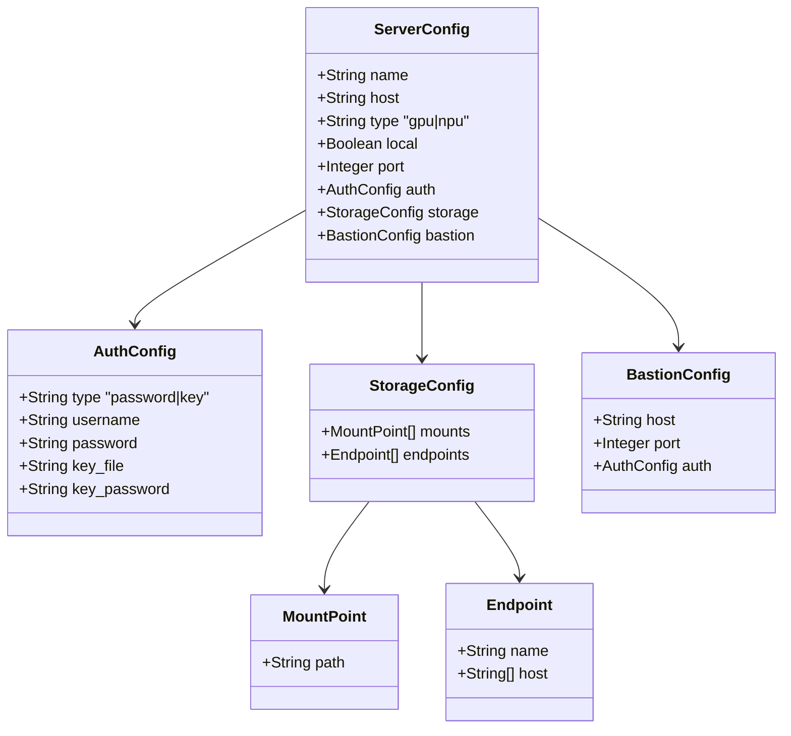
```mermaid
classDiagram
    class ServerConfig {
        +String name
        +String host
        +String type "gpu|npu"
        +Boolean local
        +Integer port
        +AuthConfig auth
        +StorageConfig storage
        +BastionConfig bastion
    }
    
    class AuthConfig {
        +String type "password|key"
        +String username
        +String password
        +String key_file
        +String key_password
    }
    
    class StorageConfig {
        +MountPoint[] mounts
        +Endpoint[] endpoints
    }
    
    class MountPoint {
        +String path
    }
    
    class Endpoint {
        +String name
        +String[] host
    }
    
    class BastionConfig {
        +String host
        +Integer port
        +AuthConfig auth
    }
    
    ServerConfig --> AuthConfig
    ServerConfig --> StorageConfig
    ServerConfig --> BastionConfig
    StorageConfig --> MountPoint
    StorageConfig --> Endpoint
```

### 3.2 运行时数据结构

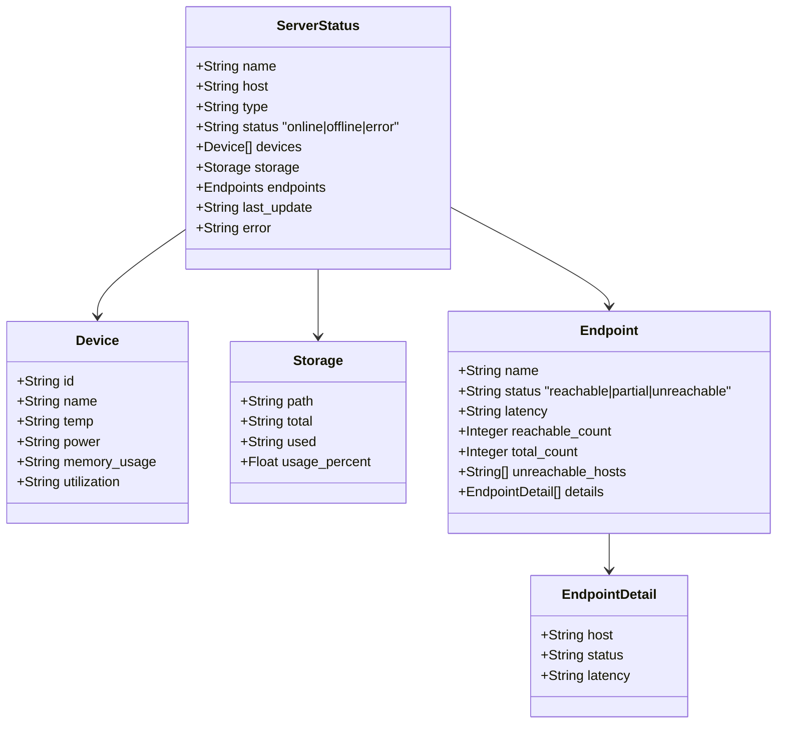
```mermaid
classDiagram
    class ServerStatus {
        +String name
        +String host
        +String type
        +String status "online|offline|error"
        +Device[] devices
        +Storage storage
        +Endpoints endpoints
        +String last_update
        +String error
    }
    
    class Device {
        +String id
        +String name
        +String temp
        +String power
        +String memory_usage
        +String utilization
    }
    
    class Storage {
        +String path
        +String total
        +String used
        +Float usage_percent
    }
    
    class Endpoint {
        +String name
        +String status "reachable|partial|unreachable"
        +String latency
        +Integer reachable_count
        +Integer total_count
        +String[] unreachable_hosts
        +EndpointDetail[] details
    }
    
    class EndpointDetail {
        +String host
        +String status
        +String latency
    }
    
    ServerStatus --> Device
    ServerStatus --> Storage
    ServerStatus --> Endpoint
    Endpoint --> EndpointDetail
```

### 3.3 数据格式兼容性策略

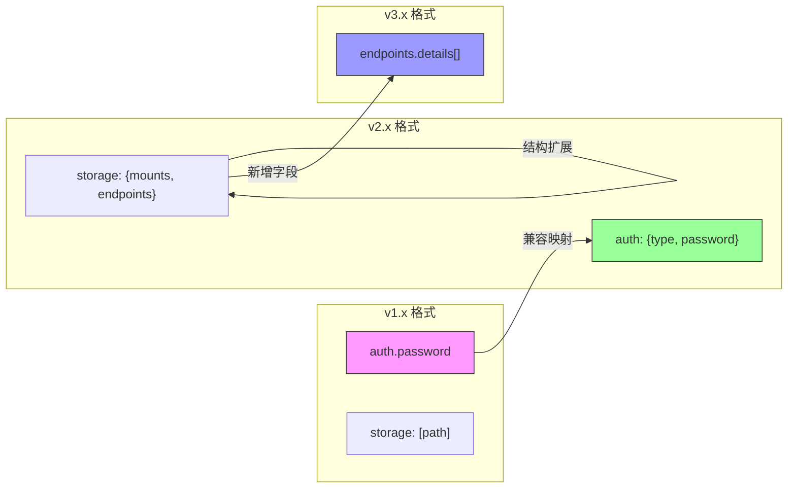
```mermaid
flowchart LR
    subgraph v1["v1.x 格式"]
        V1_Config["auth.password"]
        V1_Storage["storage: [path]"]
    end
    
    subgraph v2["v2.x 格式"]
        V2_Config["auth: {type, password}"]
        V2_Storage["storage: {mounts, endpoints}"]
    end
    
    subgraph v3["v3.x 格式"]
        V3_Endpoint["endpoints.details[]"]
    end
    
    V1_Config -->|兼容映射| V2_Config
    V2_Storage -->|结构扩展| V2_Storage
    V2_Storage -->|新增字段| V3_Endpoint
    
    style V1_Config fill:#f9f,stroke:#333
    style V2_Config fill:#9f9,stroke:#333
    style V3_Endpoint fill:#99f,stroke:#333
```

### 3.4 配置版本兼容矩阵

| 配置字段 | v1.0 | v2.0 | v3.0 | 兼容处理 |
|---------|------|------|------|---------|
| `name` | ✅ | ✅ | ✅ | 必需字段 |
| `host` | ✅ | ✅ | ✅ | 必需字段 |
| `type` | ✅ | ✅ | ✅ | 必需字段 |
| `auth.password` | ✅ | ❌ | ❌ | 映射到 `auth.password` |
| `auth.type` | ❌ | ✅ | ✅ | 默认 `password` |
| `storage.mounts` | ❌ | ✅ | ✅ | 默认 `[{path: '/'}]` |
| `storage.endpoints` | ❌ | ✅ | ✅ | 默认 `[]` |
| `endpoints.details` | ❌ | ❌ | ✅ | 运行时生成 |

---

## 4. 前后端演化逻辑

### 4.1 前端组件演化

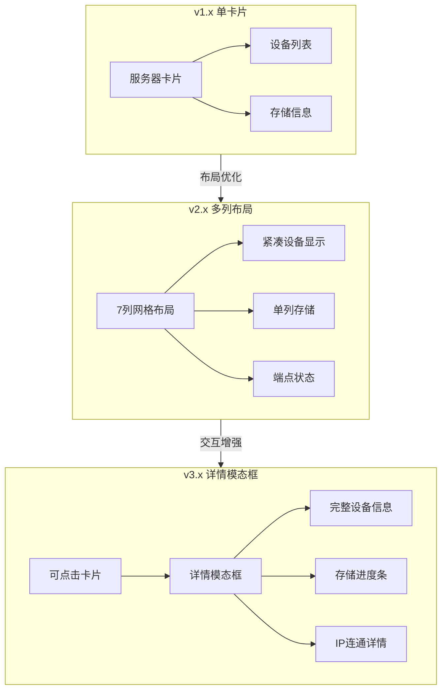
```mermaid
graph TB
    subgraph v1["v1.x 单卡片"]
        C1[服务器卡片]
        C1 --> D1[设备列表]
        C1 --> S1[存储信息]
    end
    
    subgraph v2["v2.x 多列布局"]
        C2[7列网格布局]
        C2 --> D2[紧凑设备显示]
        C2 --> S2[单列存储]
        C2 --> E2[端点状态]
    end
    
    subgraph v3["v3.x 详情模态框"]
        C3[可点击卡片]
        C3 --> M3[详情模态框]
        M3 --> D3[完整设备信息]
        M3 --> S3[存储进度条]
        M3 --> E3[IP连通详情]
    end
    
    v1 -->|布局优化| v2
    v2 -->|交互增强| v3
```

### 4.2 后端API演化

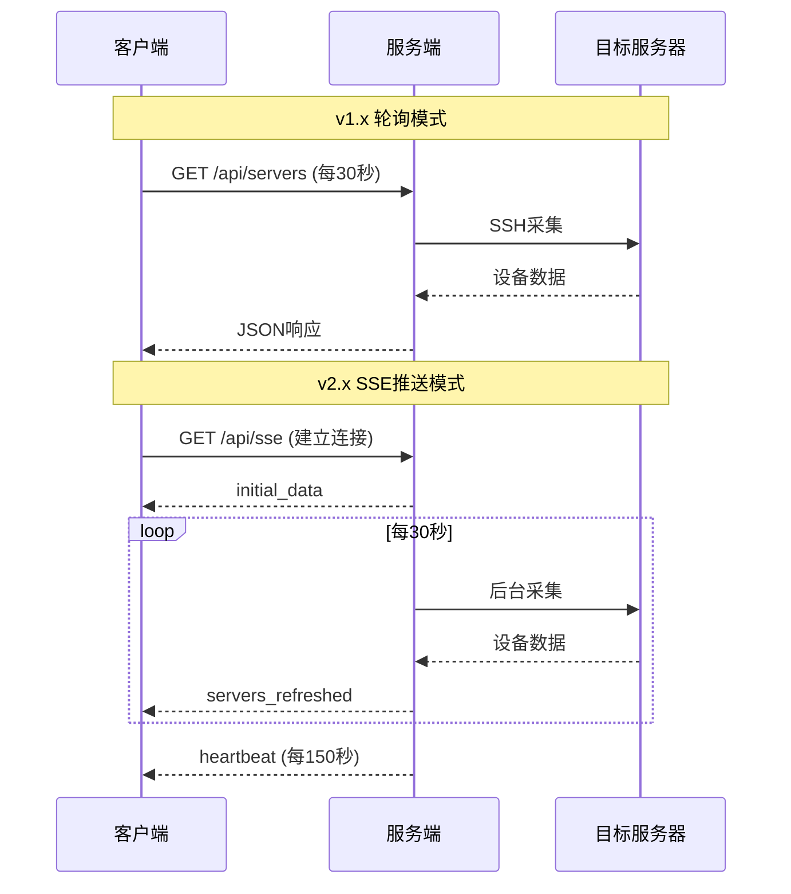
```mermaid
sequenceDiagram
    participant C as 客户端
    participant S as 服务端
    participant T as 目标服务器
    
    Note over C,T: v1.x 轮询模式
    C->>S: GET /api/servers (每30秒)
    S->>T: SSH采集
    T-->>S: 设备数据
    S-->>C: JSON响应
    
    Note over C,T: v2.x SSE推送模式
    C->>S: GET /api/sse (建立连接)
    S-->>C: initial_data
    loop 每30秒
        S->>T: 后台采集
        T-->>S: 设备数据
        S-->>C: servers_refreshed
    end
    S-->>C: heartbeat (每150秒)
```

### 4.3 数据流演化

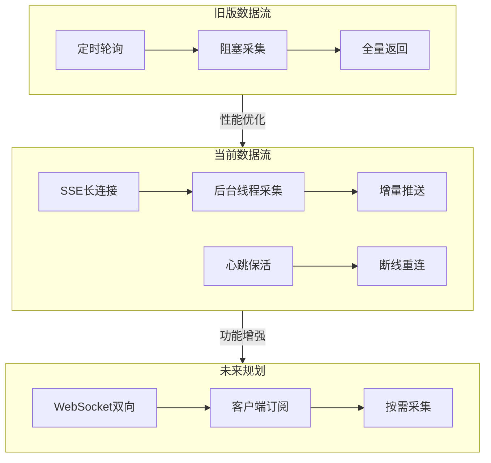
```mermaid
flowchart TB
    subgraph Legacy["旧版数据流"]
        L1[定时轮询] --> L2[阻塞采集]
        L2 --> L3[全量返回]
    end
    
    subgraph Current["当前数据流"]
        C1[SSE长连接] --> C2[后台线程采集]
        C2 --> C3[增量推送]
        C4[心跳保活] --> C5[断线重连]
    end
    
    subgraph Future["未来规划"]
        F1[WebSocket双向] --> F2[客户端订阅]
        F2 --> F3[按需采集]
    end
    
    Legacy -->|性能优化| Current
    Current -->|功能增强| Future
```

---

## 5. 核心机制实现

### 5.1 SSE连接管理

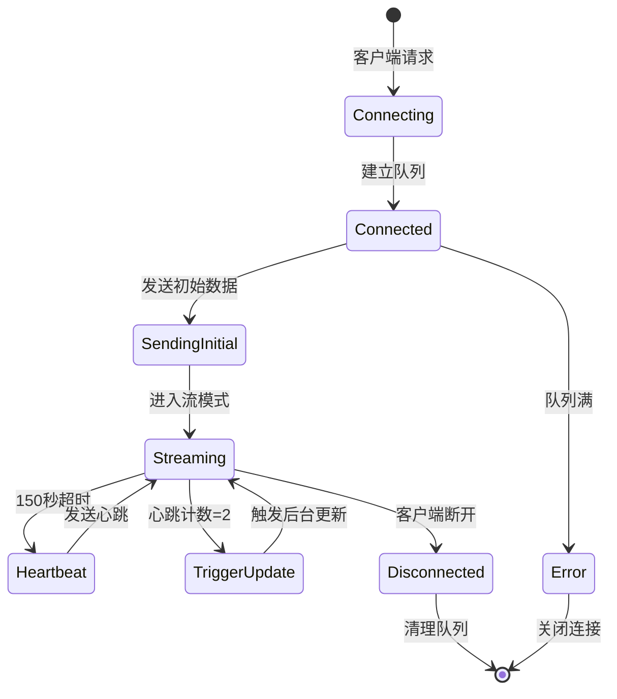
```mermaid
stateDiagram-v2
    [*] --> Connecting: 客户端请求
    Connecting --> Connected: 建立队列
    Connected --> SendingInitial: 发送初始数据
    SendingInitial --> Streaming: 进入流模式
    
    Streaming --> Heartbeat: 150秒超时
    Heartbeat --> Streaming: 发送心跳
    
    Streaming --> TriggerUpdate: 心跳计数=2
    TriggerUpdate --> Streaming: 触发后台更新
    
    Streaming --> Disconnected: 客户端断开
    Disconnected --> [*]: 清理队列
    
    Connected --> Error: 队列满
    Error --> [*]: 关闭连接
```

### 5.2 SSE实现代码结构

```python
def sse_stream():
    def generate():
        client_queue = Queue(maxsize=100)
        
        with sse_clients_lock:
            sse_clients.add(client_queue)
        
        try:
            # 发送初始数据
            initial_data = get_all_servers_status()
            yield f"data: {json.dumps(initial_data)}\n\n"
            
            heartbeat_count = 0
            while True:
                try:
                    message = client_queue.get(timeout=150)
                    yield message
                except queue.Empty:
                    heartbeat_count += 1
                    
                    # 每5分钟触发一次更新
                    if heartbeat_count % 2 == 0:
                        threading.Thread(
                            target=update_all_servers,
                            daemon=True
                        ).start()
                    
                    # 发送心跳
                    yield f"data: {json.dumps({'type': 'heartbeat'})}\n\n"
        finally:
            with sse_clients_lock:
                sse_clients.discard(client_queue)
    
    return Response(generate(), mimetype='text/event-stream')
```

### 5.3 多线程数据更新

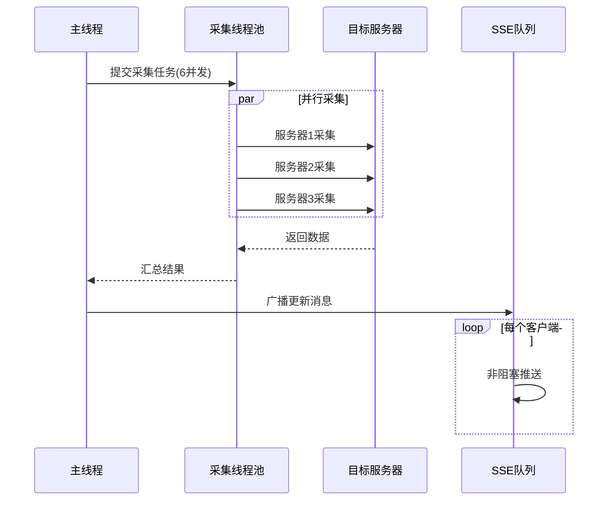
```mermaid
sequenceDiagram
    participant M as 主线程
    participant T as 采集线程池
    participant S as 目标服务器
    participant Q as SSE队列
    
    M->>T: 提交采集任务(6并发)
    
    par 并行采集
        T->>S: 服务器1采集
        T->>S: 服务器2采集
        T->>S: 服务器3采集
    end
    
    S-->>T: 返回数据
    T-->>M: 汇总结果
    
    M->>Q: 广播更新消息
    
    loop 每个客户端
        Q->>Q: 非阻塞推送
    end
```

### 5.4 并发采集流程

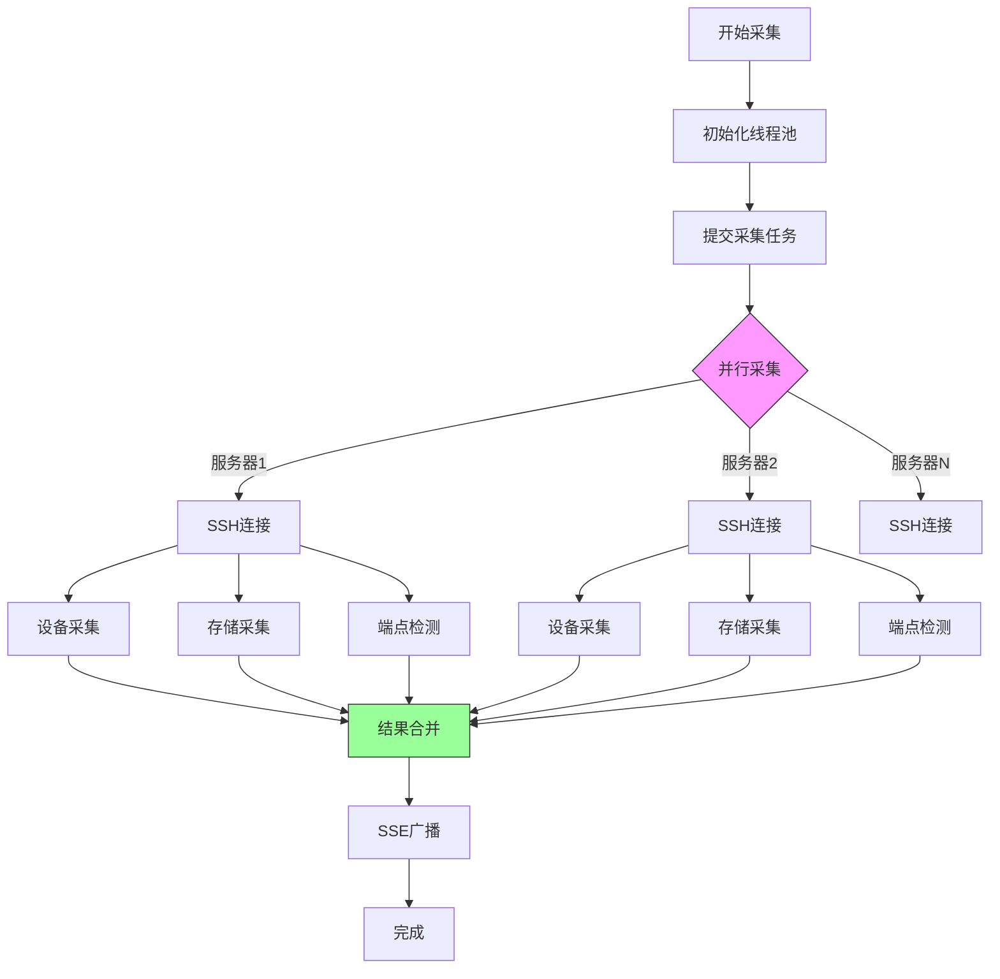
```mermaid
flowchart TB
    Start[开始采集] --> Init[初始化线程池]
    Init --> Submit[提交采集任务]
    
    Submit --> Parallel{并行采集}
    
    Parallel -->|服务器1| S1[SSH连接]
    Parallel -->|服务器2| S2[SSH连接]
    Parallel -->|服务器N| SN[SSH连接]
    
    S1 --> D1[设备采集]
    S1 --> St1[存储采集]
    S1 --> E1[端点检测]
    
    S2 --> D2[设备采集]
    S2 --> St2[存储采集]
    S2 --> E2[端点检测]
    
    D1 --> Merge[结果合并]
    D2 --> Merge
    St1 --> Merge
    St2 --> Merge
    E1 --> Merge
    E2 --> Merge
    
    Merge --> Broadcast[SSE广播]
    Broadcast --> End[完成]
    
    style Parallel fill:#f9f,stroke:#333
    style Merge fill:#9f9,stroke:#333
```

---

## 6. 性能优化策略

### 6.1 采集隔离机制

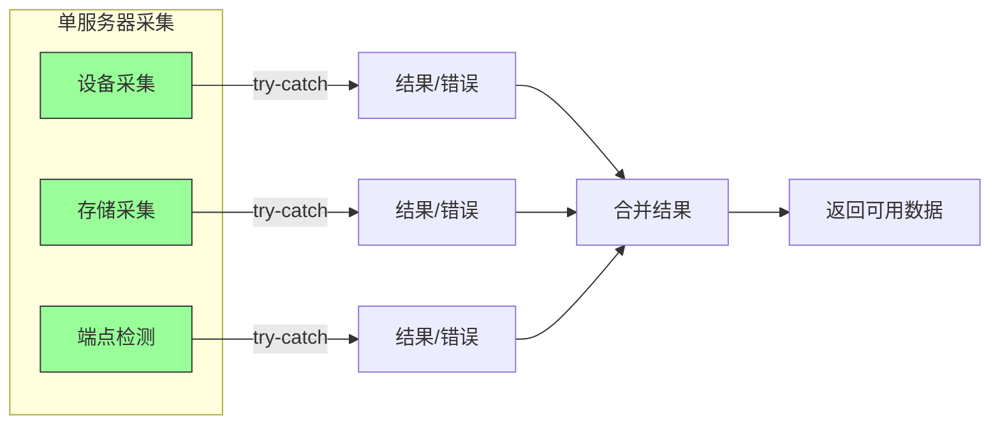
```mermaid
flowchart LR
    subgraph Server[单服务器采集]
        D[设备采集]
        S[存储采集]
        E[端点检测]
    end
    
    D -->|try-catch| R1[结果/错误]
    S -->|try-catch| R2[结果/错误]
    E -->|try-catch| R3[结果/错误]
    
    R1 --> Merge[合并结果]
    R2 --> Merge
    R3 --> Merge
    
    Merge --> Final[返回可用数据]
    
    style D fill:#9f9,stroke:#333
    style S fill:#9f9,stroke:#333
    style E fill:#9f9,stroke:#333
```

### 6.2 超时控制策略

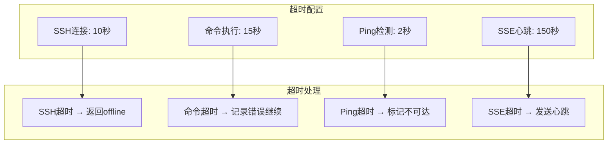
```mermaid
graph TB
    subgraph Timeouts["超时配置"]
        SSH[SSH连接: 10秒]
        CMD[命令执行: 15秒]
        PING[Ping检测: 2秒]
        SSE[SSE心跳: 150秒]
    end
    
    subgraph Handlers["超时处理"]
        H1[SSH超时 → 返回offline]
        H2[命令超时 → 记录错误继续]
        H3[Ping超时 → 标记不可达]
        H4[SSE超时 → 发送心跳]
    end
    
    SSH --> H1
    CMD --> H2
    PING --> H3
    SSE --> H4
```

### 6.3 缓存策略

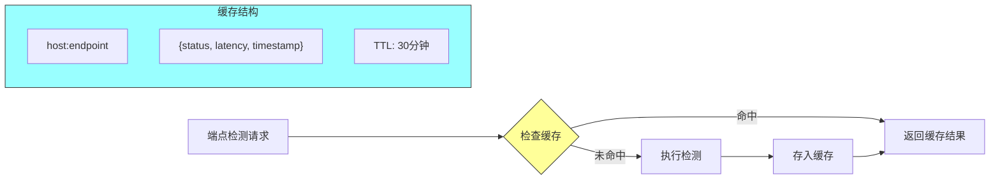
```mermaid
flowchart LR
    Request[端点检测请求] --> Check{检查缓存}
    
    Check -->|命中| Return[返回缓存结果]
    Check -->|未命中| Execute[执行检测]
    
    Execute --> Store[存入缓存]
    Store --> Return
    
    subgraph Cache["缓存结构"]
        Key["host:endpoint"]
        Value["{status, latency, timestamp}"]
        TTL["TTL: 30分钟"]
    end
    
    style Check fill:#ff9,stroke:#333
    style Cache fill:#9ff,stroke:#333
```

### 6.4 资源使用优化

| 优化项 | 策略 | 效果 |
|--------|------|------|
| SSH连接 | 每次采集新建连接，用完即关 | 避免连接泄漏 |
| 线程池 | 最大6并发 | 控制资源消耗 |
| SSE队列 | 最大100条消息 | 防止内存溢出 |
| 端点缓存 | 30分钟TTL | 减少网络请求 |
| 命令超时 | 15秒超时 | 防止阻塞 |

---

## 7. 扩展性设计

### 7.1 新设备类型扩展

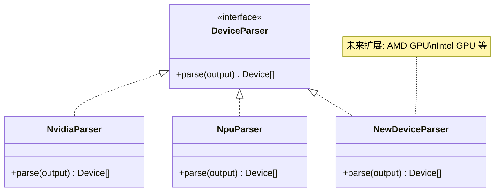
```mermaid
classDiagram
    class DeviceParser {
        <<interface>>
        +parse(output) Device[]
    }
    
    class NvidiaParser {
        +parse(output) Device[]
    }
    
    class NpuParser {
        +parse(output) Device[]
    }
    
    class NewDeviceParser {
        +parse(output) Device[]
    }
    
    DeviceParser <|.. NvidiaParser
    DeviceParser <|.. NpuParser
    DeviceParser <|.. NewDeviceParser
    
    note for NewDeviceParser "未来扩展: AMD GPU\nIntel GPU 等"
```

### 7.2 配置扩展点

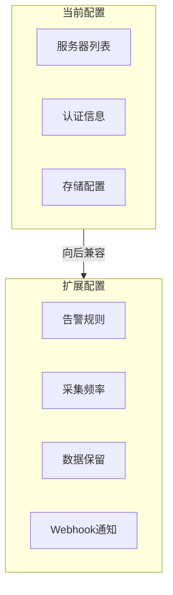
```mermaid
flowchart TB
    subgraph Current["当前配置"]
        C1[服务器列表]
        C2[认证信息]
        C3[存储配置]
    end
    
    subgraph Future["扩展配置"]
        F1[告警规则]
        F2[采集频率]
        F3[数据保留]
        F4[Webhook通知]
    end
    
    Current -->|向后兼容| Future
```

### 7.3 未来架构演进

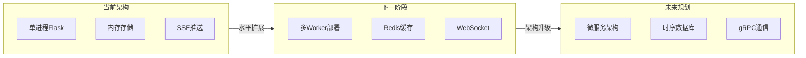
```mermaid
graph LR
    subgraph Now["当前架构"]
        N1[单进程Flask]
        N2[内存存储]
        N3[SSE推送]
    end
    
    subgraph Next["下一阶段"]
        M1[多Worker部署]
        M2[Redis缓存]
        M3[WebSocket]
    end
    
    subgraph Future["未来规划"]
        F1[微服务架构]
        F2[时序数据库]
        F3[gRPC通信]
    end
    
    Now -->|水平扩展| Next
    Next -->|架构升级| Future
```

---

## 附录

### A. 命令输出格式参考

#### A.1 nvidia-smi 输出格式

```
+-----------------------------------------------------------------------------------------+
| GPU  Name                 Persistence-M | Bus-Id          Disp.A | Volatile Uncorr. ECC |
| Fan  Temp   Perf          Pwr:Usage/Cap |           Memory-Usage | GPU-Util  Compute M. |
|                                         |                        |               MIG M. |
|=========================================+========================+======================|
|   0  NVIDIA H100 80GB HBM3          On  |   00000000:18:00.0 Off |                    0 |
| N/A   34C    P0            116W /  700W |   79101MiB /  81559MiB |      0%      Default |
+-----------------------------------------+------------------------+----------------------+
```

#### A.2 npu-smi info 输出格式

```
+------------------------------------------------------------------------------------------------+ 
| NPU   Name                | Health        | Power(W)    Temp(C)           Hugepages-Usage(page)| 
| Chip                      | Bus-Id        | AICore(%)   Memory-Usage(MB)  HBM-Usage(MB)        | 
+===========================+===============+====================================================+ 
| 0     910B3               | OK            | 93.2        37                0    / 0             | 
| 0                         | 0000:C1:00.0  | 0           0    / 0          64549/ 65536         | 
+===========================+===============+====================================================+ 
```

### B. 错误码定义

| 错误码 | 含义 | 处理建议 |
|--------|------|---------|
| `SSH_TIMEOUT` | SSH连接超时 | 检查网络连通性 |
| `SSH_AUTH_FAILED` | 认证失败 | 检查用户名密码/密钥 |
| `CMD_TIMEOUT` | 命令执行超时 | 检查服务器负载 |
| `PARSE_ERROR` | 输出解析失败 | 检查命令版本兼容性 |
| `ENDPOINT_UNREACHABLE` | 端点不可达 | 检查网络/防火墙 |

### C. 监控指标说明

| 指标 | 单位 | 采集方式 | 说明 |
|------|------|---------|------|
| 温度 | °C | nvidia-smi/npu-smi | GPU/NPU核心温度 |
| 功耗 | W | nvidia-smi/npu-smi | 当前功耗/功耗上限 |
| 显存使用 | MB | nvidia-smi/npu-smi | 已用/总量 |
| 利用率 | % | nvidia-smi/npu-smi | GPU/NPU计算利用率 |
| 磁盘使用 | GB | df -h | 已用/总量 |
| 端点延迟 | ms | ping | ICMP响应时间 |
